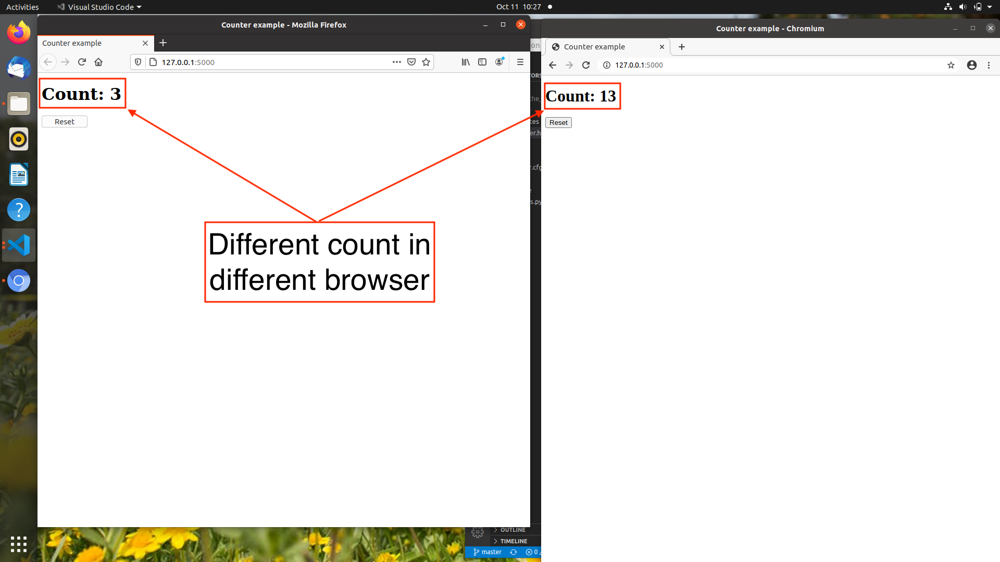
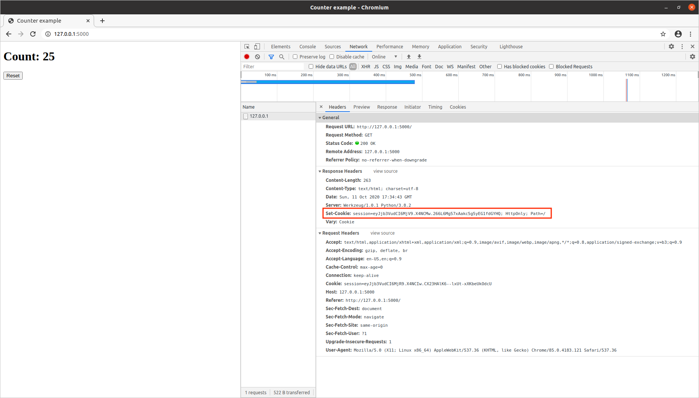
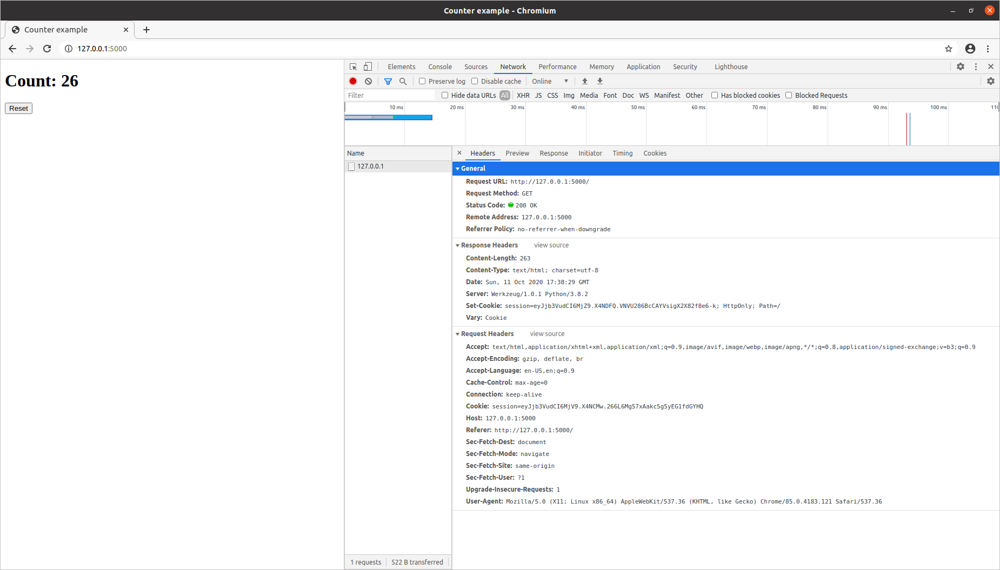
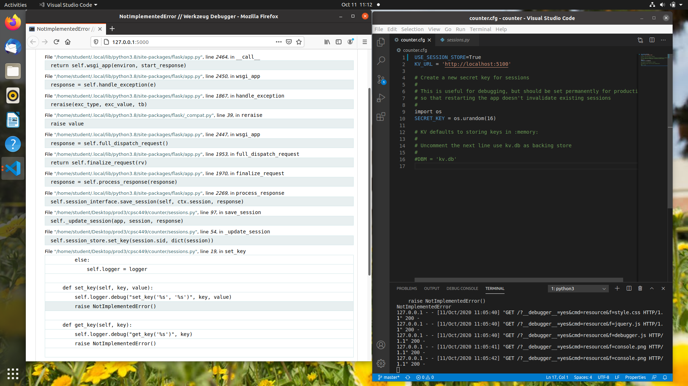

# CPSC449-Project3
 # Authors: 
Mauricio Macias (mauricio.macias@csu.fullerton.edu) 890741622  
Andrew Dinh	(decayingapple@csu.fullerton.edu) 893242255  

## 0 Installation
Make sure you are in the project root and run:

"foreman start"

To run both microservice processes.

## 1 Background 

For this project we will learn to make HTTP requests from a Python program and use this ability to store server-side session data in a separate service. 

This project was completed by 2 people. Whose names are listed in the very top of this paper.

## 2 Learning HTTP request
**counter.html**
When USE_SESSION_STORE = False  
Flask will use default session implementation: storing the session variables count in a signed cookie on the client side.
  
Notice that the two browsers do not share the same count variable. 
**Browser developer tools**
Here are viewing the `Set-Cookies: response header `
  
Notice that it changes each time the page is refreshed.
  
**counter.html**
When USE_SESSION_STORE = True  
Flask will load the counter page.
  
Notice the methods of keyVaueSessionStore have not yet been implemented. 
