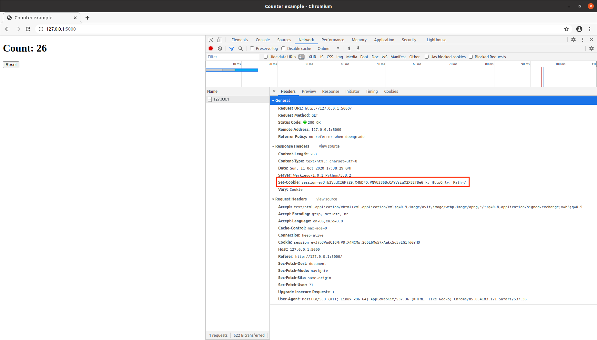

# CPSC449-Project3
 # Authors: 
Mauricio Macias (mauricio.macias@csu.fullerton.edu) 890741622  
Andrew Dinh	(decayingapple@csu.fullerton.edu) 893242255  

## 0 Installation
Make sure you are in the project root and run:

"foreman start"

## 1 Background 

For this project we will learn to make HTTP requests from a Python program and use this ability to store server-side session data in a separate service. 

This project was completed by 2 people. Whose names are listed in the very top of this paper.

## 2 Learning HTTP request
### Question #2
When USE_SESSION_STORE = False  
Flask will use default session implementation: storing the session variables count in a signed cookie on the client side.  
  
Notice that the two browsers do not share the same count variable.   
### Question #3
### Browser developer tools
Here are viewing the `Set-Cookies: response header `  
  
Notice that it changes each time the page is refreshed.  
  

### Question 6
### counter.html
When USE_SESSION_STORE = True  
Flask will load the counter page.  
  
Notice the methods of keyVaueSessionStore have not yet been implemented.   

### Quesion 8
Flask will use now store sessions into a key-value store.  
  
But,notice that the two browsers do not share the same count variable.   

### Question 9 
Here are viewing the `Set-Cookies: response header `  
  
Notice that it `Set-Cookies` does not change each time the page is refreshed.  
  

### Question 10
Here are going to Click the Reset Button, Notice that the POST request clears the session cookie.  
  
Then the subsequent GET request generates a new session id.  
  

### Question 11
Then we are going to use our dump.py script to list the active sessions in the key-value store.  
  
